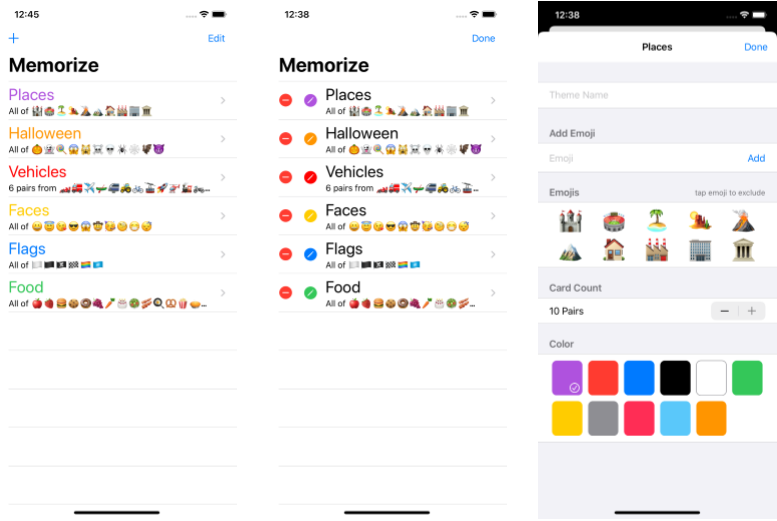

# assigment_5 Memorize
## Required Tasks
1. Memorize应用程序现在应在启动时显示“主题选择器” UI参阅所附的图像作为示例
2. 使用列表显示主题
3. 列表中的每一行显示主题名称，主题颜色，主题中有多少张卡片以及主题中表情符号的一些采样。 
4. 触摸“列表”中的主题，即可导航（即列表位于NavigationView中）以玩具有该主题的游戏。
5. 游戏中，主题名称应该显示在屏幕上的某个位置，并且您还应该继续支持现有功能，例如乐谱，新游戏等（但是如果您愿意，可以重新排列UI）。
6. 从玩游戏回到选择器，然后再回到进行中的游戏可以重启游戏，尽管精明的实现可能不会这样做（除非修改了相关主题（参见下文）），几乎肯定会想要重启游戏）。 
7. 提供一些UI，以将新主题添加到选择器中的“列表”中。 
8. 选择器必须支持“编辑模式”，可以在其中删除主题并可以访问某些用户界面（即每行中的按钮或图像），这将以模态方式（例如，通过工作表或弹出窗口）打开该主题的主题编辑器用户界面。
9. 主题编辑器必须使用表格。 
10. 在主题编辑器中，允许用户编辑主题名称，向主题添加表情符号，从主题中删除表情符号并指定主题中有多少张卡片。 （能够编辑主题的颜色是“额外的功劳”）
11. 主题必须是持久性的（即重新启动应用程序不应导致您所做的所有主题编辑都丢失）。 
12. 保证不同设备的模拟器的portrait or landscape（横屏竖屏）都运行正常 

## Hints
1. 可能首先要为选择器创建一个ViewModel。这只是您主题的商店（比起EmojiArt商店，它甚至更简单，因为不支持就地重命名，因此甚至不需要名称词典）。仅需要一个简单的主题数组，即可将其作为JSON持久存储在UserDefaults中（可通过Homework 5实现）。
2. 由于此新ViewModel只是一个存储区（即它不执行任何逻辑），因此没有理由不将其主题数组设置为非私有（即，您无需涵盖您可以进行的所有更改）这个新ViewModel中带有功能的主题，只需让View直接操作主题数组即可）。 
3. 肯定要“自动保存”对主题数组的任何更改（我们在EmojiArt中做过两次不同的时间，因此您应该熟悉如何使用发布者来执行此操作）。 
4. 在EmojiArt的文档选择器中，只有一个Text（然后是EditableText）代表列表中的行。但是，绝对没有理由不能创建自己的自定义视图来代替。
5. 可以通过创建一些带有表情符号的简单的默认主题（类似于“无标题”文档）来使“添加主题”变得更加容易，然后用户可以通过将其带入自己的口味来简单地对其进行编辑稍后使用“调色板编辑器”。即添加主题按钮不必调出自己的模式面板。 
6. 不要在您的主题编辑器视图中使代码巨大。将其分解为较小的视图（例如，每个部分一个）。同样在自定义视图中清晰地组织代码，以显示列表中的每一行。 
7. 对于主题编辑器（如主题编辑器），有两种通用策略。第一个是“实时编辑”，第二个是“完成/取消” 
8. 在“实时编辑”中，用户对主题所做的更改将立即存储在商店中。如果所使用这种方法（在iOS中通常是首选方法），则可以将ViewModel（您的商店）以及要编辑的主题传递给主题编辑器（并将用户所做的更改视为“用户意图” ”，并在商店中具有Intent函数来执行它们。）或者可以在ViewModel中直接使用Binding到主题数组中。后一种方法可能有些棘手，因为还支持从该数组中删除主题，因此可能会遇到从其他视图绑定直接删除主题的情况（取决于是否将主题绑定绑定到视图）
9. 在“完成/取消”样式模式视图中，您将具有“完成”按钮在主题编辑器中的某个位置可以关闭主题编辑器，并在主题编辑器重新回到商店时将对主题所做的所有更改复制到商店中，然后您还有一个“取消”按钮，可以在不更新商店的情况下关闭主题编辑器。
10. 如果最终进行了“实时编辑”，请使用.environmentObject（）将ViewModel（主题存储）传递给主题编辑器（即不要将其作为参数传递，而应使用@ObservedObject）。 在将ViewModels传递给模态呈现的View时是必需的，此外，构成主题编辑器的View都将始终需要它，因此，它们都可以仅使用@EnvironmentObject来获取它。 
11. 不要让主题编辑器用户界面选择要在主题中显示的几对卡片，选择的数字要大于主题中可用表情符号的数量！也不要让它选择一对。 
12. 在编辑过程中，任何时候只要主题中的表情符号少于两个，就必须决定该怎么办。
13. “必填任务”没有说明要使用哪种UI才能在主题编辑器中从主题中添加或删除表情符号，可以自定义。

## Things to Learn
1. List
2. Form
3. NavigationView
4. Modal presentation
5. TextField
6. EditMode
7. Multiple MVVMs
8. Publisher
9. UserDefaults 

## Extra
1. 支持在主题编辑器中选择主题的颜色。 
2. 跟踪用户从主题中删除的任何表情符号，作为“已删除”或“不包括”表情符号。然后增强主题编辑器，使他们在改变主意时可以将删除的表情符号放回原处。 永远记住这些已删除的表情符号（即必须将状态添加到主题结构中）。