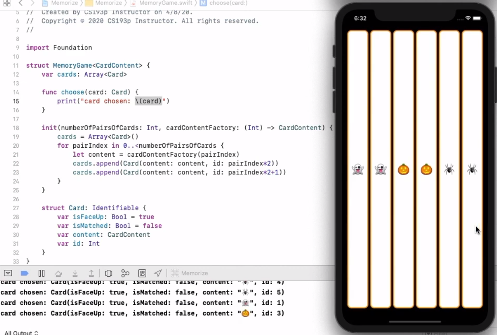

# lecture_2 Demo_Memorize 总结
## Demo Topics: Memorize
- **MVVM and Types in Action**  
    + We’re going to use the special **init** function (in both our Model and our ViewModel)  
    + We’re going to use generics in our implementation of our Model  
    + We’re going to use a function as a type in our Model  
    + We’re going to see a **class** for the first time (our ViewModel will be a class)  
    + We’re going to implement an “Intent” in our MVVM  
    + And finally, we will make our UI “reactive” through our MVVM design  

## view模块
- **ContentView.swift**  
    - 文件开头 `import SwiftUI`  
    - 主要实现了UI，最终四张card并列显示在屏幕上

## model模块
- **MemoryGame.swift**  
    - 文件开头 `import Foundation`  
    - `struct card{}` 定义一张card要有什么属性  
    - `init{}`  初始化

## viewModel模块
- **EmojiMemoryGame.swift**  
    - 本质上还是UI部分的，所以文件开头 `import SwiftUI`  
    - 通过viewmodel把model连到view上

## 最终效果
主要实现了每张card都有唯一identifier，通过model获取卡片的数量、卡面内容等，还有点击卡片的反馈

