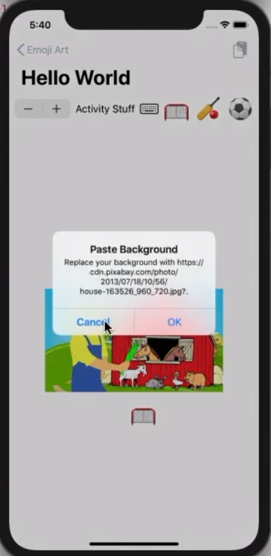

# lecture_10 Demo_EmojiArt 总结
## Demo Topics: EmojiArt
- **.sheet**
- **.popover**
- **TextField**
- **Form**
- More about Constraints and Gains via Grid enhancement
- Dismissing modally presented Views via @Bindings
- Multiple MVVMs in a single application
- **Hashable** and **Equatable**
- **NavigationView** + **NavigationLink** + **.navigationBarTitle/Items**
- Alerts
- Deleting from a ForEach with **.onDelete**
- **EditButton**
- EditMode @Environment variable (a @Binding)
- Setting @Environment variables
- **.zIndex**

## view模块
- **EmojiArtDocumentView.swift**
   + 增加粘贴image作为背景图功能
   + 放到viewmodel **EmojiArtDocument.swift** 里，才可以和model同步
    `@State private var steadyStateZoomScale: CGFloat = 1.0`
    `@State private var steadyStatePanOffset: CGPoint = .zero`
     并改为
    `@Published var steadyStateZoomScale: CGFloat = 1.0`
    `@Published var steadyStatePanOffset: CGPoint = .zero`
   + 将 `steadyState` 都替换成 `document.steadyState`
   + 增加复制按钮
   + 增加复制的两个alert弹窗，一个提示无效url或者重复url，一个提示是否更换image

- **PaletteChooser.swift**
    + 增加修改paletteName的按钮
    + 点开后为popover弹窗，里面可以修改paletteName、删除/添加emoji
    + sheet样式的弹窗，增加done即保存按钮
    + 改回popover弹窗，并通过设置`.zIndex(-1)`让其在ipad上也正常使用

- 从项目Memories导入**Grid.swift**和**GridLayout.swift**
    + 修改，让emoji可以网格排列

- **新增EmojiArtDocumentChooser.swift**
    + `List{}` 显示文件列表
    + 显示页面Title
    + 增加新建文件按钮
    + 增减edit按钮
        * 删除文件
        * 编辑文件名称

- **导入EditableText.swift**

- **Spinning.swift**

- **OptionalImage.swift**

- **AnimatableSystemFontModifier.swift**

## model模块
- **EmojiArt.swift**

- **EmojiArtDocumentPalette.swift**

## extension
- **EmojiArtExtensions.swift**

## viewModel模块
- **EmojiArtDocument.swift**
    + 关于hashable的问题处理要再研究一下
    + 和model同步，使得粘贴进来的image背景图在返回后再回来还能保持位置和大小

- **导入EmojiArtDocumentStore.swift**
    + 这里关于hashable的问题处理要再研究一下
    + 文件存储

## 创建项目时已有的文档
- **SceneDelegate.swift**
    + `let store = EmojiArtDocumentStore(named: "Emoji Art")`
      `//store.addDocument()`
      `//store.addDocument(named: "Hello World")`
      `let contentView = EmojiArtDocumentChooser().environmentObject(store)`

## 最终效果

## MyTips
- 关于hashable的问题
- 关于document的问题，特别是**EmojiArtDocumentStore.swift**导入后修改view的内容
- 关于`@State`、`@Published`、`$`