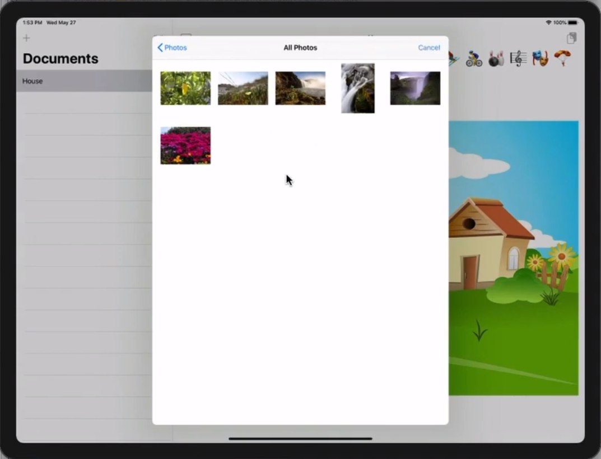

# lecture_14 Demo 总结
## Demo Topics: Enroute
- **Choose Destination Airport from a Map**
    + No Map in SwiftUI, so let’s use the one from UIKit
    + integrating a UIView into SwiftUI

- **FilterFlight.swift**
    + destination这一块加入MapView

- **新建MapView.swift**
    + 在地图上标出各机场
    + 选择destination，定位到地图上的标签，zoom地图
    + 反向，选择地图上的标签，destination变成相应的目的地

## Demo Topics: EmojiArt
- **Set our EmojiArt Background from the Camera**
    + No Camera API in SwiftUI either, but there’s one in UIKit we can use
    + integrating a UIViewController into SwiftUI
    + the image we set as our EmojiArt background only works on the device that created it!

- **EmojiArtDocumentView.swift**
    + 增加相册按钮
    + 增加相机按钮，并判断设备是否有摄像头，如果有才显示这个图标，还要在 info.plist 文件里加上使用摄像头的权限的询问

- **新建ImagePicker.swift**
    + 打开相册
    + 获取相册的image
    + `typealias PickedImageHandler = (UIImage?) -> Void`，用typealias代替functions arguments，如果频繁被使用的话这样可以有效防止出错

## 最终效果

