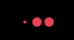
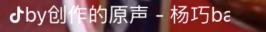
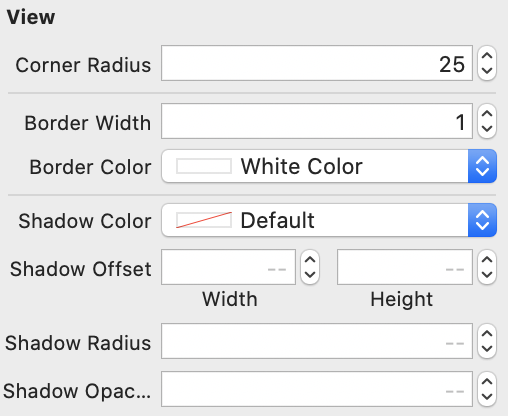
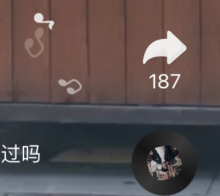
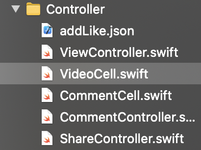
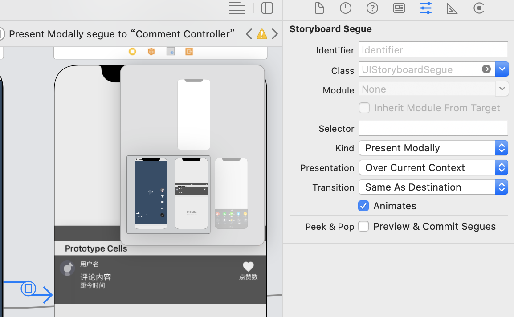
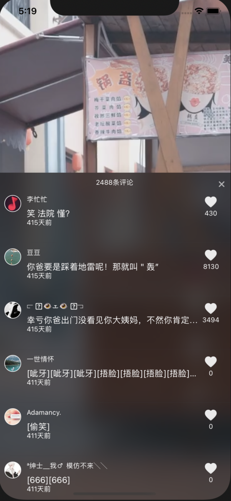
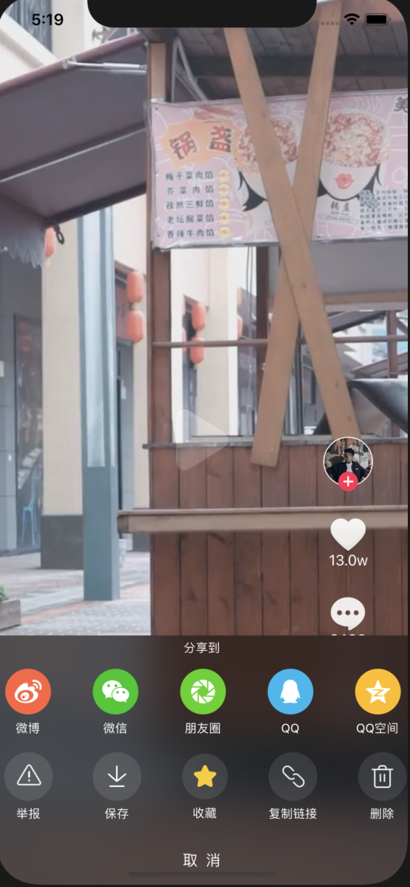

# 抖音首页视频播放的一个仿写demo

这是找实习之前10天研究的一个demo，也是找实习简历上唯一的项目经历

注意：需要下载 Visual Studio Code，在里面安装 Live Server，然后打开文件夹`douyinTestServer`，再点`go Live`运行本地服务器，然后再运行项目才能获取数据

## 主要实现的功能

1. 整体采用 `tableview` 实现，使用自定义的 `cell`，并实现了 `cell` 的复用

2. 使用 框架**[Kingfisher](https://github.com/onevcat/Kingfisher)** 下载、缓存网络图片，这是一个轻量级纯swift库

3. **服务器和数据来源：**Visual Studio Code 的 Live Server 运行的[本地数据库](https://github.com/Sophia-fez/Standford-CS193p-2020Spring-SwiftUI/tree/master/IOS-APP-Demo/DouYinProjectMaterial/douyinTestServer)

4. **loading动画：**使用 框架**[NVActivityIndicatorView](https://github.com/ninjaprox/NVActivityIndicatorView)** 实现，使用的是ballPluse效果（三个小圆球），使用了自定义的 `myPink` 颜色，效果如下

   

   ```swift
   @IBOutlet weak var loadingView: NVActivityIndicatorView!
   
   loadingView.startAnimating() // 数据加载完之前播放loading动画
   loadingView.stopAnimating()  // 数据加载完后停止播放loading东湖
   ```

   Tips：理论上应该可以控制动画播放进度和是否重复播放等，有空研究再一下这个框架

5. **滚动的music名：**使用 框架**[MarqueeLabel](https://github.com/cbpowell/MarqueeLabel)** 实现跑马灯效果，即music名的文字滚动

   

   ```swift
   @IBOutlet weak var labelMusic: MarqueeLabel!
   
   labelMusic.text = aweme.music!.title! + " - " + aweme.music!.author! // 获取数据库里json数据
   labelMusic.restartLabel() // 这句不写也能跑马灯
   ```

6. **圆角、阴影**

   - 按钮：加圆角，加边框、边框颜色
   - 弹窗：加阴影、阴影位移、阴影圆角、阴影透明度

   可以对 `UIView` 写  `extension` ，加上 `@IBInspectable`  可以使得这些属性在storyboard里可见并设置

   ```swift
   extension UIView {
       @IBInspectable public var cornerRadius: CGFloat {} // 加圆角
       @IBInspectable public var borderWidth: CGFloat {} // 加边框
       @IBInspectable public var borderColor: UIColor {} // 边框颜色
       @IBInspectable public var shadowColor: UIColor {} // 阴影色
       @IBInspectable public var shadowOffset: CGSize {} // 阴影的位移
       @IBInspectable public var shadowRadius: CGFloat {} // 阴影的圆角
       @IBInspectable public var shadowOpacity: Float {} // 阴影的透明度
   }
   ```

   

7. **唱盘转动、音符散发动画**

   

   - **唱盘内图片转动动画**

     使用 框架**[JHChainableAnimations](https://github.com/jhurray/JHChainableAnimations)** 实现

     ```swift
     var diskAnimator: ChainableAnimator! // 转盘的动画
     
     diskAnimator = ChainableAnimator(view: subDiskView) // 将动画关联到唱盘subDiskView
     diskAnimator.rotate(angle: 180).animateWithRepeat(t: 3.5, count: 50) // 旋转并重复
     ```

   - **音符散发动画**

     `extension UIView` 里增加音符散发动画函数 `func raiseAnimate(){}`，音符轨迹使用 **[贝塞尔曲线](https://zh.javascript.info/bezier-curve)**，使用 `UIBezierPath()`

     ```swift
     // 音符散发动画
     func raiseAnimate(imageName: String, delay: TimeInterval) {}
     
     // 清除上一个页面所有动画，还原初试状态，以便重复使用单元格
     func resetViewAnimation() {
       for layer in layers {
         layer.removeFromSuperlayer()
       }
       self.layer.removeAllAnimations()
     }
     ```
     
     最后在加载cell数据的时候播放该动画，注意使用不通过的音符image，设置不同的延迟，最终达到音符散发的效果
     
     ```swift
     // 音符散发动画
     diskView.raiseAnimate(imageName: "icon_home_musicnote1", delay: 0) // raiseAnimate()写在extension里了，所有的UIView都可以用
     diskView.raiseAnimate(imageName: "icon_home_musicnote2", delay: 1) // 延迟1s散发第二个音符
     diskView.raiseAnimate(imageName: "icon_home_musicnote1", delay: 2) // 延迟2s散发第三个音符
     ```

8. **点赞动画**

   简单一点可以实现一个点击button后缩放然后换image的效果，复杂一点的叠加lottie的json动画

   **8.1 button缩放动画&换image**

   给需要点击后有缩放效果的 button 选上 ScaleAnimateButton 的 class就可以了，8.2里的点赞爆裂效果`AnimateButton.swift`也是类似的

   ```swift
   // 点击评论等icon一个缩小再放大的动画效果
   class ScaleAnimateButton: UIButton {
       // 当view本身别添加到父视图之上时，增加一个点击事件
       override func willMove(toSuperview newSuperview: UIView?) {
           super.willMove(toSuperview: newSuperview)
           
           // 添加一个点击事件
           addTarget(self, action: #selector(toggleSelected), for: .touchUpInside)
       }
       
       @objc func toggleSelected() {
           isSelected.toggle()
       }
       
       // 为选中添加一个动画，缩小
       override var isSelected: Bool {
           get {
               super.isSelected
           }
           set {
               super.transform = .init(scaleX: 0.8, y: 0.8)
               
               UIView.animate(withDuration: 0.5, delay: 0, usingSpringWithDamping: 0.7, initialSpringVelocity: 0.1, options: [.beginFromCurrentState, .transitionCrossDissolve]) {
                   super.isSelected = newValue
                   super.transform = .identity
               }
           }
       }
   }
   ```

   **8.2 使用 框架[lottie-ios](https://github.com/airbnb/lottie-ios) 叠加动画层实现点赞爆裂动画**

   在 [lottieFiles 官网搜索 explode](https://lottiefiles.com/search?q=explode&category=animations)，然后按照 Popular 排序的第一个，下载它的json文件即可。这里找的就是一个和抖音比较相似的点赞动画，效果如下

   

   这个json文件如果放在和 Controller 一级的文件夹下就不需要考虑 bundle 问题了

   

   在点击点赞按钮后做出如下反应：

   - 点赞人数+1；再次点button是取消点赞，点赞人数也要-1

   - 点赞image换成红色的点赞后的效果；再次点button是取消点赞，把 image 设置成 `icon_home_like_before`即可，不需要动画

     ```swift
     addLikeBtn.setImage(UIImage(named: "icon_home_like_after"), for: .normal)
     ```

   - 叠加 lottie 点赞爆裂动画层，在动画播放完毕后移除动画层（不移除动画层的话就无法再次点到button就无法取消点赞了！）。因为上一步改变了button的image所以这边动画层移除后还会保持已点赞的状态，lottie使用教程见[Lottie-Swift版本介绍及基本使用](https://www.jianshu.com/p/c77c05eb5db8)

     Tips：lottie找的动画和这边的 icon_home_like_after 图片过渡效果不太行，可以找一个更接近的image换上去，或者重写动画效果，见文件 `AnimateButton.swift`（github里暂时没放，研究后再说吧）

     ```swift
     addLikeAnimator = AnimationView(name: "addLike") // 将动画关联到点赞按钮
     
     // 动画的范围，frame或者使用自动布局，这里位置不对
     addLikeAnimator.frame = CGRect(x: -addLikeBtn.center.x - 8, y: -addLikeBtn.center.y - 15, width: 106, height: 106)
     
     // 添加到父视图上
     addLikeBtn.addSubview(addLikeAnimator)
     
     addLikeAnimator.play(fromProgress: 0, toProgress: 1, loopMode: .playOnce) { (isFinished) in
     		// 播放完成后的回调闭包
     		self.addLikeAnimator.stop()
     		self.addLikeAnimator.removeFromSuperview()
     }
     ```

   - 实现点赞和取消点赞，设置一个 Bool 类型的变量 `likeTapped` 来监听是否点了点赞按钮，把上面三块的代码放入对应的地方即可

     ```swift
     // 监测是否点赞
     var likeTapped: Bool = false {
       didSet {
         if likeTapped {
           print("点赞")
         } else {
           print("取消点赞")
         }
       }
     }
     ```

9. **cell的复用**

   主要是重写 `func prepareForReuse() {}`

   ```swift
   // 重复使用cell所以有些动画要清空重制
   override func prepareForReuse() {
     // 重制关注按钮的所有动画
     if addFollowAnimator != nil {}
   
     // 重置音符散发动画
     diskView.resetViewAnimation()
   
     // TODO: 点赞按钮的状态是否重制，判断条件应该是获取服务器json数据里是否点过赞
     addLikeBtn.setImage(UIImage(named: "icon_home_like_before"), for: .normal) // 重置点赞icon为白色
     likeTapped = false // 重置点赞状态
   
     super.prepareForReuse()
   }
   ```

10. **评论弹窗**

   - 弹窗需要新建一个CommentViewController，从主屏的评论按钮到CommentViewController 的 Presentation 改为 Over Current Context，因为默认的打开方式是会将主屏缩小的

   

   - **弹窗的退出**

     - 点叉叉或者取消等button

     ```swift
     // 点击关闭按钮关闭评论弹窗
     @IBAction func tapClose(_ sender: UIButton) {
       self.dismiss(animated: true)
     }
     ```

     - 点弹窗以外的空白区域：主要是使用 `tapPoint` 变量判断点击的点是否在弹窗区域内

      ```swift
     // 点击其他空白区域关闭评论弹窗
     @IBAction func tapToClose(_ sender: UITapGestureRecognizer) {
     
       // 单机手势点击时相对于评论弹窗view的位置
       let tapPoint = sender.location(in: commentAreaView)
     
       // 如果位置不位与评论view内则关闭该view,即这个view包不包含点击的这个点
       if !commentAreaView.layer.contains(tapPoint) {
         self.dismiss(animated: true)
       }
     }
      ```

     CommentController和CommentCell也就是table里的具体内容和主屏的tableView实现方式基本差不多，故不再赘述
     
     

11. **分享弹窗**

    Tips：分享弹窗和评论弹窗是一样的，代码复用问题待解决；scrollview待实现

    

12. [**自定义 button 上图下字垂直居中**](https://www.jianshu.com/p/4603e9bbba56)

    `UIButton`的另一个重要的属性就是`UIEdgeInsets`，称之为偏移量，分别有`contentEdgeInsets，imageEdgeInsets，titleEdgeInsets`三个相关属性。
    默认情况下：

    - contentEdgeInsets 的 top、left、bottom、right都是相对于button本身，控制着image和title整体的偏移量；
    - imageEdgeInsets 的 top、left、bottom相对于button，right相对于title，控制着image的相对偏移量；
    - titleEdgeInsets 的 top、bottom、right相对于button，left相对于image，控制着title的相对偏移量；

13. **ASPlayer框架，视频播放**

    实现视频滑到屏幕中间指定的大小就开始播放AutoVideoPlayer的功能
    cell里：

    - 在单元格中申明AVPlayerlayer()的变量，一旦视频有了值之后就向视频播放器通过url进行初始化

      ```swift
      var videoLayer = AVPlayerLayer()
      var videoURL: String? {
        didSet {
          if let videoURL = videoURL {
            ASVideoPlayerController.sharedVideoPlayer.setupVideoFor(url: videoURL)
          }
          videoLayer.isHidden = videoURL == nil
        }
      }
      ```

    - 设置视频的高度，要把视频层页面上可见高度设置为屏幕高度

      ```swift
      func visibleVideoHeight() -> CGFloat {
        let videoFrameInParentSuperView = superview?.superview?.convert(coverImageView.frame, from: coverImageView)
      
        guard let videoFrame = videoFrameInParentSuperView, let superViewFrame = superview?.frame else {
          return 0
        }
      
        let visibleVideoFrame = videoFrame.intersection(superViewFrame)
        print("视频可见高度： ", visibleVideoFrame.size.height)
        return visibleVideoFrame.size.height
      }
      ```

    controll里：

    - viewDidLoad里加入一个通知，是的app进入后台的时候暂停视频播放

      ```swift
      NotificationCenter.default.addObserver(self, selector: #selector(self.appEnteredFromBackground), name: UIApplication.willEnterForegroundNotification, object: nil)
      
      @objc func appEnteredFromBackground() {
        ASVideoPlayerController.sharedVideoPlayer.pausePlayeVideosFor(tableView: tableView, appEnteredFromBackground: true)
      }
      ```

    - 当一个播放页面从页面上移除时，即滑动到下一页时，把播放页移除，实现cell的复用

      ```swift
      func tableView(_ tableView: UITableView, didEndDisplaying cell: UITableViewCell, forRowAt indexPath: IndexPath) {
        if let videoCell = cell as? ASAutoPlayVideoLayerContainer, let _ = videoCell.videoURL {
          ASVideoPlayerController.sharedVideoPlayer.removeLayerFor(cell: videoCell)
        }
      }
      ```

    - scroll停止时，暂停视频

      ```swift
      func scrollViewDidEndDragging(_ scrollView: UIScrollView, willDecelerate decelerate: Bool) {
        if !decelerate {
          self.pausePlayerVideos()
        }
      }
      
      func scrollViewDidEndDecelerating(_ scrollView: UIScrollView) {
        pausePlayerVideos()
      
        currentPage = tableView.indexPathsForVisibleRows!.last!.row
      
        // 获取视频
        if currentPage == (awemeList.count - 1) {
          OperationQueue.main.addOperation {
            print("开始获取新视频")
            self.videoJsonIndex -= 1
            let localUrl = URL(string: DouyinURL.baseLocal + self.videoJsonIndex.description + DouyinURL.feedFile)!
            self.dataFrom(local: true)
          }
        }
      }
      ```

      注：

      - `scrollViewDidEndDecelerating`表示减速结束了，并不是就一定等于滑动结束了。因为有些滑动并不需要减速也可以结束，比如我两只手轮流向左滑动，直到滑动到scrollview的尽头为止，这个过程的滑动是被迫终止而不是自然减速停止，这样`scrollViewDidEndDecelerating`方法是不会被执行的。
      - `scrollViewDidEndDragging`是停止拖拉，即手离开屏幕，但手抬起后，可能还会滑行一段时间直到减速停止。所以也不等于滑动结束。
      - 唯一确定的是`scrollViewDidEndDragging`肯定在`scrollViewDidEndDecelerating`之前，经过判断，如果手抬起后不再减速，即直接停止滑动


## 待实现/研究/优化功能

### 复用

1. 点赞功能的复用，现在 VideoCell 和 CommentCell 分别实现了点赞动画
2. 弹窗代码的复用，现在 CommentController 和 ShareController 分别实现了弹窗效果

### 待实现

1. 分享页面的scrollView左右滑动


